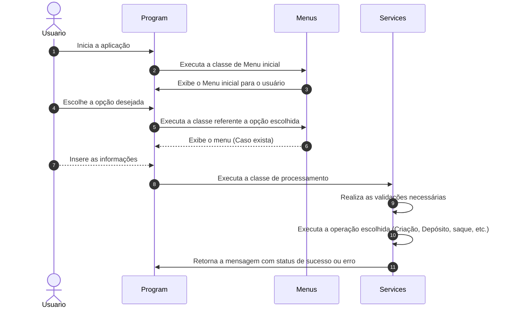
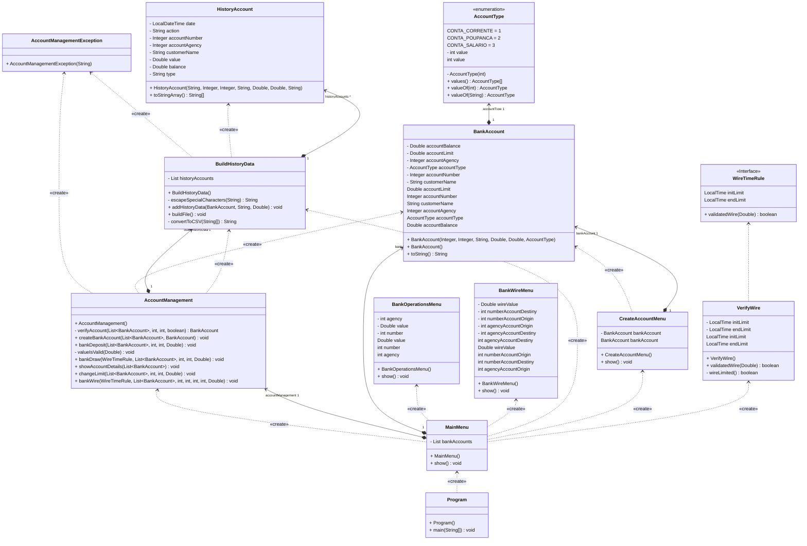

# curso-java-desafio1

Primeiro desafio do Programa **Renew your Career (Java & Spring Boot)**.

## 📄 Diagramas
### Diagrama de sequência da aplicação


Diagrama de classes da aplicação



## 🚀 Começando

Essas instruções permitirão que você obtenha uma cópia do projeto em sua máquina local para fins de desenvolvimento e teste.

### 📋 Pré-requisitos

- **[Git](https://git-scm.com/downloads)**
- **[Java 11 ou superior](https://www.oracle.com/br/java/technologies/javase/jdk11-archive-downloads.html)**
- **IDE compatível com a linguagem JAVA**

### 🔧 Instalação

1. Realize o clone do projeto através do Github:
```
git clone https://github.com/daniloosouza/curso-java-desafio1.git
```
2. Importe o projeto na IDE de sua preferência:


## ⚙️ Execução

1. Execute a classe Program, contida em:
   ```/src/application/Program.java```
2. Será exibido um Menu Principal no Console com as opções:
```   
1 - Cadastro de conta bancária
2 - Listagem de contas bancárias
3 - Depósito
4 - Saque
5 - Alterar limite de transação diária
6 - Realizar transferência
7 - Exportar histórico de transações
0 - Sair 
```
3. Escolha a opção desejada e insira as informações necessárias
4. Como resultado da opção 7, será gerado um arquivo em 
``/src/resources/files/history`` com o nome de : **actions-history.csv** 
5. Ao final da execução de cada ação, é mostrada uma mensagem de sucesso.
6. Caso ocorra algum erro durante a execução, mensagens informativas sobre o erro serão exibidas.
7. Para encerra a aplicação, escolha a opção **0** no Menu Principal.


## ✒️ Autores
* **Danilo de Oliveira** - **[github](https://github.com/daniloosouza)**

---